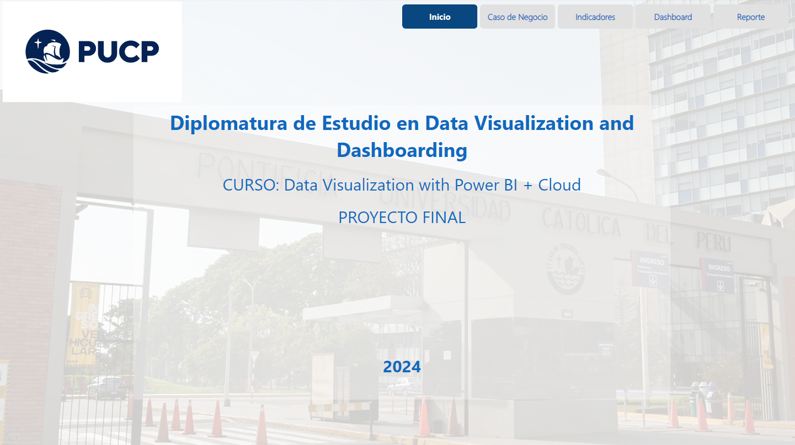

Link hacia el archivo Power BI:

# **CASO DE NEGOCIO**

## **OBJETIVO:** 
Al 31 de julio de 2024 el INDICADOR MENSUAL DE MARGEN DE CONTRIBUCION POR TONELADA VENDIDA DE GLP ENVASADO PARA LA EMPRESA  ABC es de 620 unidades (soles por tonelada). Para el 31 de diciembre de 2024, se desea incrementar el indicador hasta llegar a un valor de 899 unidades (soles por tonelada vendida).

## **ESTRATEGIA:** 
Para lograr este objetivo se plantea implementar una estrategia de marketing para aumentar las ventas en la región centro, enfocando la publicidad de la marca LG en el segmento A.

## **COSTO BENEFICIO:** 
El costo total de la implementación de marketing en la región centro es de 2,000,000 soles. Se estima que al cumplir este objetivo al 31 de diciembre del 2024, se generaría una facturación adicional de 4 570 020 mensuales, lo cual durante los primeros 12 meses posteriores a la fecha de cumplimiento del objetivo generaría una facturación total adicional de 54.840.240.

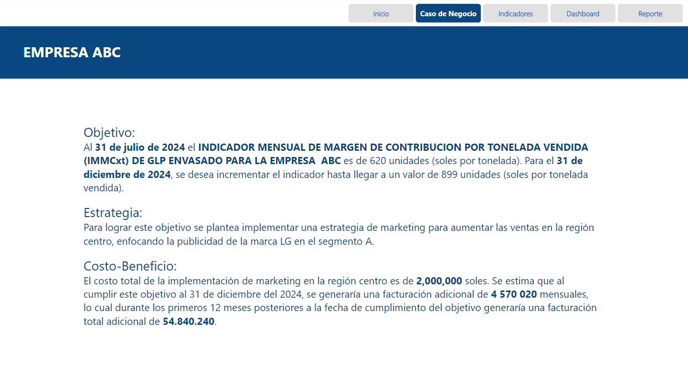

# **INDICADOR**
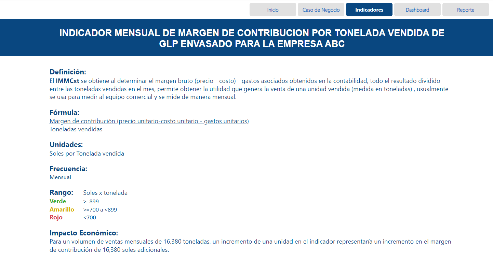

# **DASHBOARD**
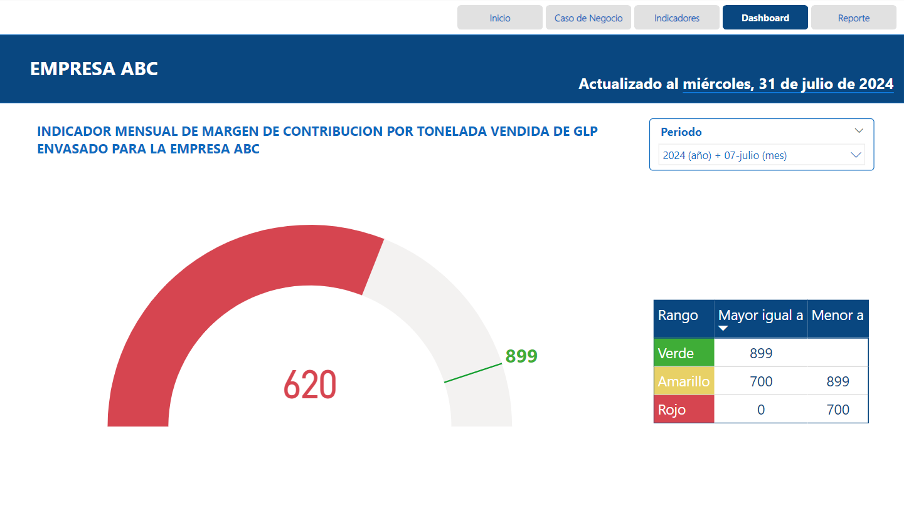

# **REPORTE**
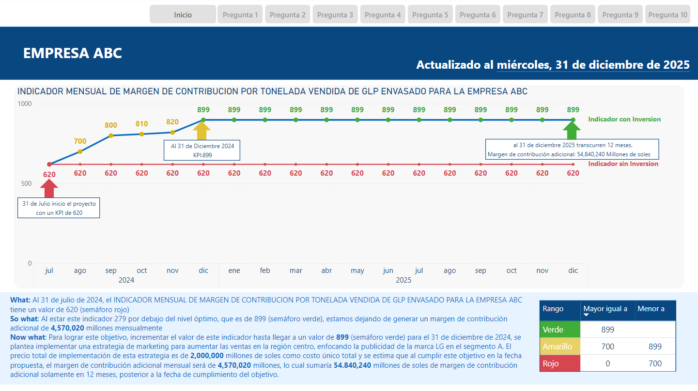

# **CONSIDERACIONES POWER BI**

## **USO DE FUNCIONES DE FECHA Y HORA** 
Para gestionar los datos de tipo Fecha, se creó la Tabla Calendario que permitió ajustar los períodos de análisis al construir las visualizaciones, dado que el negocio se mide por ventas mensuales, lo cual fue un aspecto clave para utilizar segmentadores y responder las diferentes preguntas. Se adjunta el codigo en el archivo 6tablaCalendario.txt
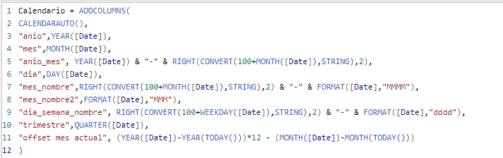

# **PANTALLAS DE APLICACIÓN**

## **PREGUNTA 1** 
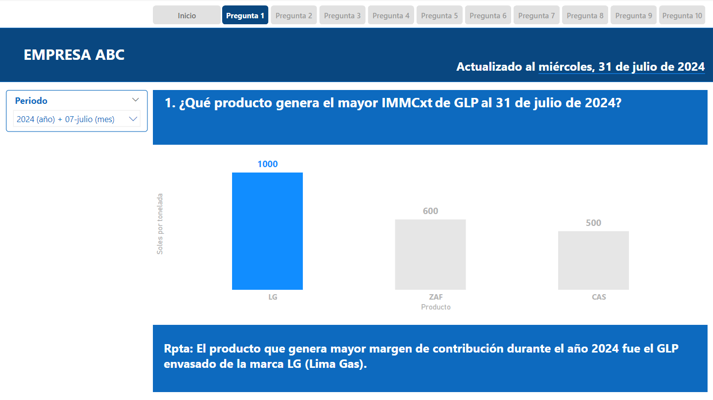

La pregunta número 1 tiene como objetivo determinar cual de las 3 marcas de GLP envasado (LG: Limagas, CAS:Caserito, ZAF: Zafiro) generó el mayor margen de contribución por tonelada en el periodo del 1 de enero al 31 de julio 2024. De acuerdo con el análisis y la gráfica presentada se puede observar que la marca LG Limagas generó un IMMCxt de 1000 soles.

## **PREGUNTA 2** 
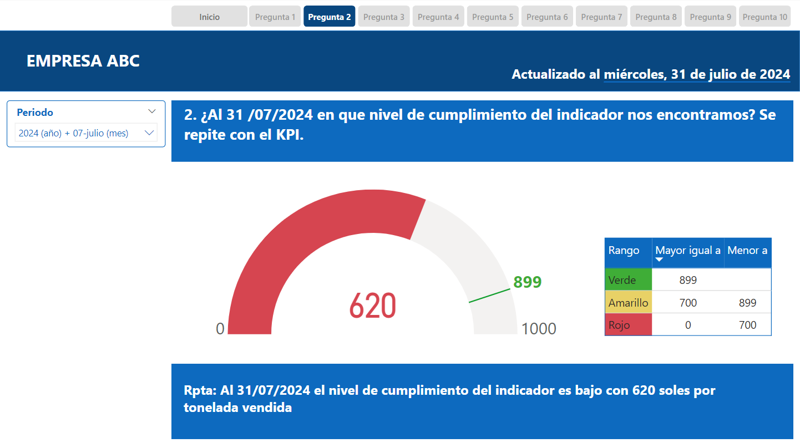

La pregunta número 2 tiene como objetivo presentar el porcentaje de eficiencia a nivel de gasto respecto al IMMCxt de las tres marcas de GLP envasado entre el periodo del 1 de enero al 31 de julio del 2024.
La gráfica nos muestra que el producto LG presenta una eficiencia de 55%, seguido de ZAF (50%) y CAS (20%) 

## **PREGUNTA 3** 
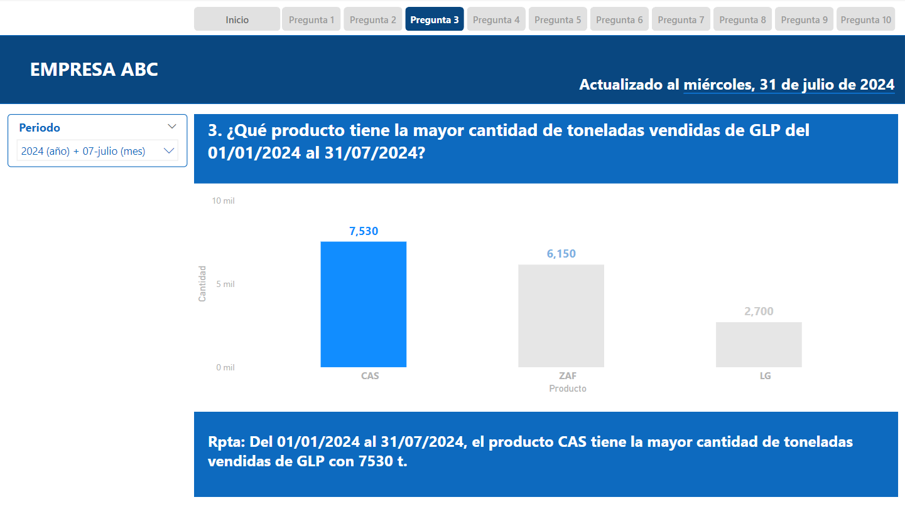

La pregunta número 3 tiene como objetivo  presentar la marca de GLP envasado con la mayor cantidad de toneladas vendidas en el periodo del 1 de enero al 31 de julio del 2024. Conforme con la visualización del diagrama de barras, se destaca el producto CAS con 7530 toneladas vendidas seguido de la marca ZAF (6150 t) y finalmente LG (2700 t).
 
## **PREGUNTA 4** 
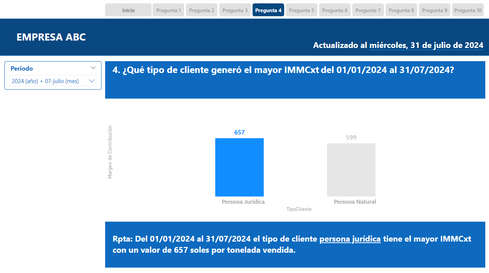

La pregunta número 4 busca identificar que tipo de cliente generó el mayor margen de contribución  por tonelada de GLP en el periodo del 01/01/24 al 31/07/2024. Del gráfico presentado se desprende que el tipo de cliente “Persona Jurídica” generó el mayor IMMCxt, obteniendo 657 soles por tonelada vendida, con este resultado podemos dirigir nuestras estrategias de marketing a este tipo de cliente.

## **PREGUNTA 5** 
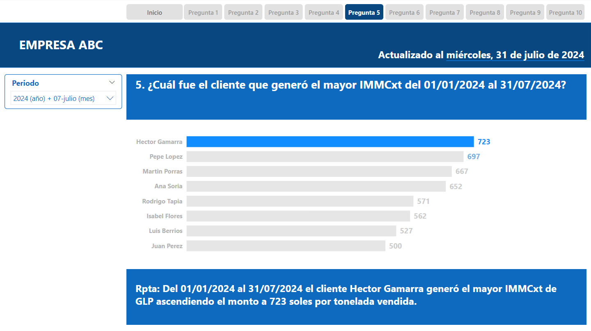

la pregunta número 5 tiene como objetivo conocer cual de nuestros clientes generó el mayor IMMCxt durante el periodo del 01/07/2024 al 31/07/2024, de nuestro análisis obtuvimos que Hector Gamarra generó el mayor IMMCxt, obteniendo 723 soles por tonelada vendida, con esta información implementaremos nuestras estrategias en la fidelización de clientes.

## **PREGUNTA 6** 
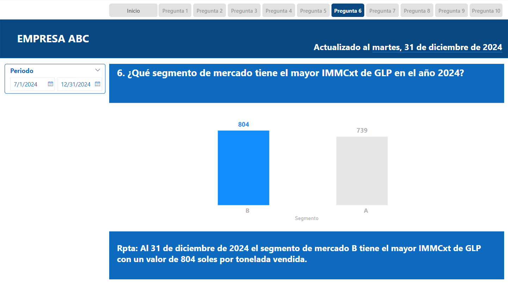

La pregunta número 6 tiene como objetivo mostrar cual de los 2 segmentos con los cuales contamos en el mercado obtuvo el mayor IMMCxt en el periodo del 01/01/24 al 31/07/24 , al respecto, la gráfica presenta que el segmento B tiene el mayor IMMCxt con el valor de 804  soles  por tonelada vendida.

## **PREGUNTA 7** 
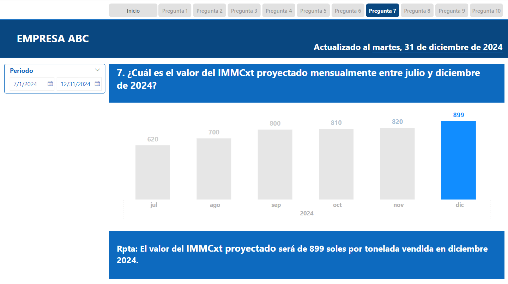

La pregunta 7 tiene como finalidad presentar la evolución proyectada mensualmente del IMMCxt entre julio y diciembre de 2024 para verificar el impacto de la estrategia de marketing respecto al cumplimiento del objetivo en el tiempo estimado.
Iniciando en julio con un valor de 620, agosto 700, septiembre 800, octubre 810, noviembre 820 y finalmente llegando a diciembre 899 de IMMCxt.

## **PREGUNTA 8** 
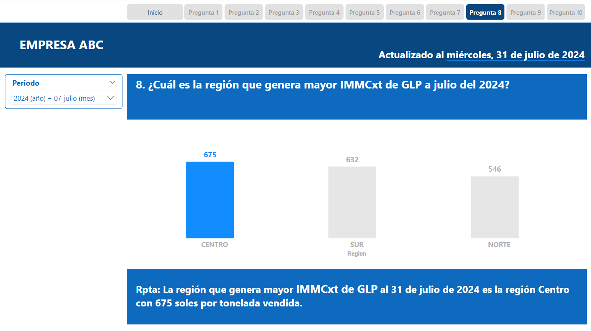

La pregunta número 8 busca determinar la región que generó el mayor IMMCxt entre el periodo enero y julio de 2024, lo que nos permitió identificar que la locación indicada en la cual se implementará la estrategia de marketing es la región Centro con 675 de IMMCxt.

## **PREGUNTA 9** 
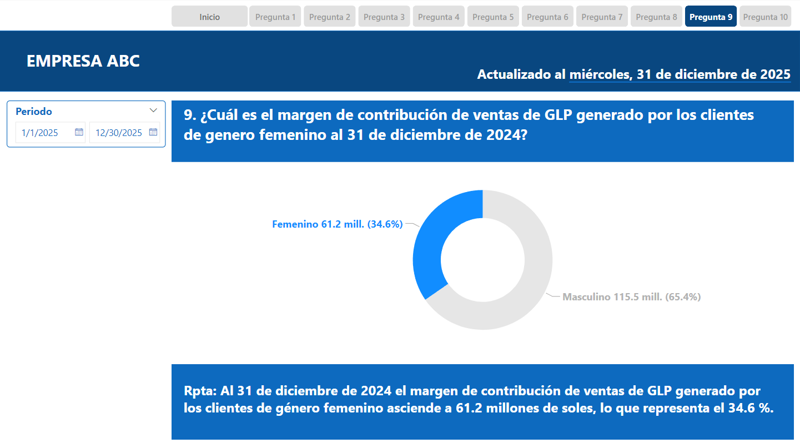

La pregunta número 9 tiene como objetivo identificar el margen de contribución (Ventas-Costos-Gastos) generado a través de las ventas realizadas al público femenino entre enero y julio de 2024 el cual corresponde a 3.5 millones de soles (34.6%).

## **PREGUNTA 10** 
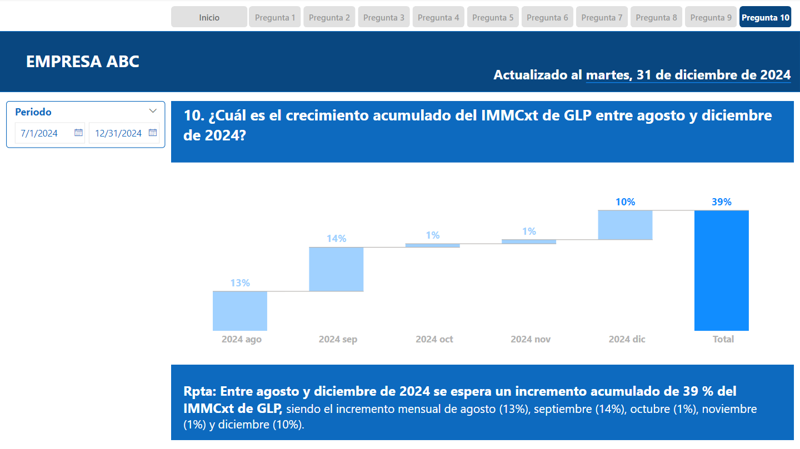

La pregunta 10 tiene como objetivo determinar el porcentaje de crecimiento acumulado del IMMCxt, generado durante la implementación de la estrategia de marketing en la región Centro, el cual asciende a 39 % entre agosto y diciembre de 2024.
